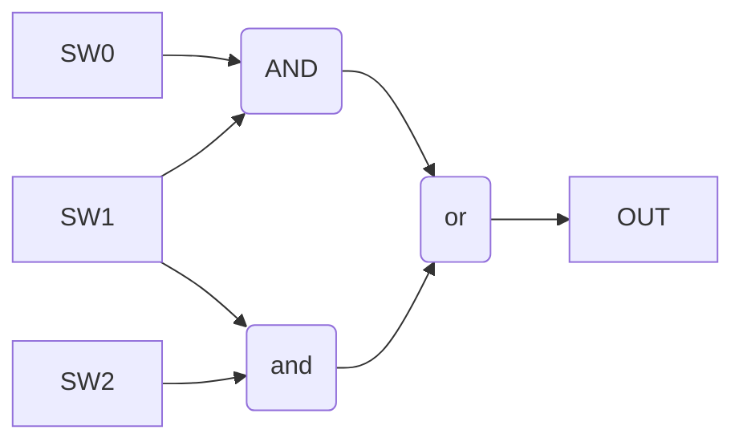

| SW0  | SW1  | SW2  | OUT  |
| ---- | ---- | ---- | ---- |
| 0    | 0    | 0    | 0    |
| 1    | 0    | 0    | 0    |
| 0    | 1    | 0    | 0    |
| 1    | 1    | 0    | 1    |
| 0    | 0    | 1    | 0    |
| 1    | 0    | 1    | 0    |
| 0    | 1    | 1    | 1    |
| 1    | 1    | 1    | 1    |

